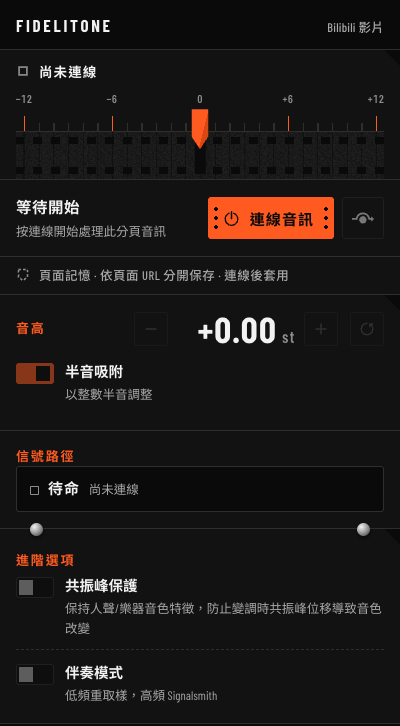
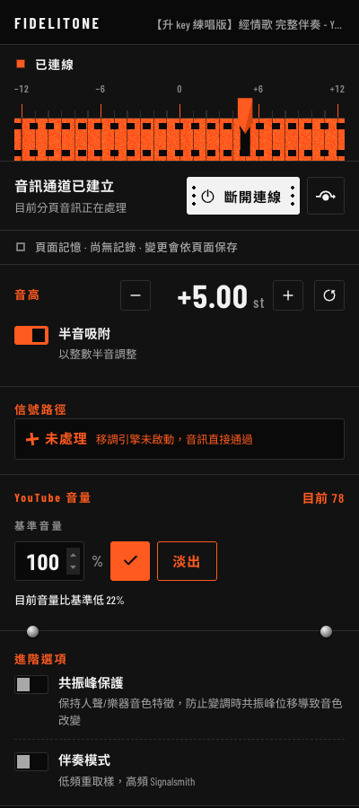
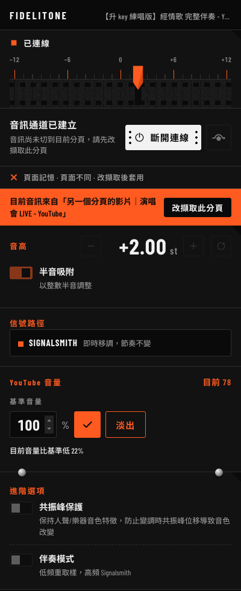

# Fidelitone

Real-time audio pitch transposition for Chrome tabs.

Transpose the pitch of audio playing in any Chrome tab without affecting tempo.
Works with YouTube, Spotify Web, SoundCloud, and any other web audio source.


The rail across the top is the whole interface: drag the pennant to the
semitone you need and let go. Everything below it tells you what the extension
is actually doing to the audio — including when that is nothing.


## Features

- Real-time pitch shifting — **~100 ms** of processing latency, measured rather
  than estimated (see [Latency](#latency))
- Adjustable range: -12 to +12 semitones
- Preserves original tempo
- Per-page memory: every page URL keeps its own pitch, bypass, formant and
  accompaniment settings (sparse — only non-default values are stored)
- Follows the tab you switch to, and applies that page's remembered settings
- Accompaniment mode: a 175 Hz crossover so the bass is resampled instead of
  stretched, which is what keeps low notes solid
- Toolbar badge shows where the audio is coming from (`ON` / `ON·` / `!`)
- YouTube volume control: set the page volume to an exact 0–100 value with a
  500 ms fade instead of a jump — apply it against a persistent baseline, or
  fade the page out to silence
- No external audio processing required
- Works on any website with audio playback


## Screenshots

| | |
| --- | --- |
| <br>Opening the popup never captures anything on its own — **連線音訊** is the only entry point. | <br>The page remembers the setting, so coming back to this URL restores it. |
| <br>Accompaniment mode. Below 175 Hz goes through this project's own resampler rather than the stretcher. | <br>When the engine cannot start, the signal path says so, instead of leaving a slider that appears to do nothing. |
| <br>The audio belongs to another tab. The popup names it, offers to re-capture, and locks the controls because those settings are a different record. | |

These are the real built popup driven against a mock of the `chrome.*` APIs, so
every state is reproducible without a capture running — `npm run preview` serves
them at `http://localhost:8743/popup.html` with the state selected by query
string.


## Installation

### From Source

```bash
git clone https://github.com/your-username/fidelitone.git
cd fidelitone
npm install
npm run build
```

Then load the extension in Chrome:

1. Open `chrome://extensions/`
2. Enable "Developer mode"
3. Click "Load unpacked"
4. Select the `dist/` folder

### Development

```bash
npm test           # vitest
npm run typecheck  # tsc --noEmit
npm run dev        # content:watch + vite --watch
npm run latency    # measure the pitch engine's latency in a browser
npm run preview    # serve the built popup against a mock chrome API
```

`npm run build` needs nothing beyond the npm dependencies — there is no native
toolchain step. CI runs the same three checks plus a build-output assertion
(`.github/workflows/ci.yml`).


## Usage

1. Open a tab with audio (YouTube, Spotify Web, etc.)
2. Click the extension icon in the Chrome toolbar — the popup opens and grants
   Chrome the per-tab permission a capture needs. Nothing is captured yet:
   press **連線音訊** when you want Fidelitone to take over the tab's audio
3. Adjust the pitch slider to shift audio up or down
4. Toggle bypass on/off with the power button
5. Switch to another tab: the capture follows it and that site's remembered
   settings are applied automatically

On `https://www.youtube.com/` the popup also shows a **YouTube 音量** panel:

- **基準音量** — a global 0–100 value you keep, entered as a percentage;
  **套用** (the ✓ icon) fades the page volume to it over 500 ms, **淡出** fades
  down to silence, and the panel reports how far the page has drifted in the
  same language (`目前音量比基準低 20%`). Works whether or not the popup is
  connected — nothing here needs a capture.

Volume changes go through YouTube's own player API when it is available, so the
native volume slider and mute icon follow along; without it the writer falls
back to `<video>.volume` directly. The player API is JavaScript the page owns,
which is invisible from a normal (isolated-world) content script, so writes are
routed through a second content script injected with `"world": "MAIN"` and
acknowledged back over `window.postMessage` — reload the YouTube tab after
reloading the extension, or the panel reports the missing bridge instead of
failing silently.

Toolbar badge states:

| Badge | Meaning |
| --- | --- |
| *(none)* | Nothing is being captured |
| green `ON` | Capturing the tab you are looking at |
| orange `ON·` | Capturing another tab (audio is not from the active tab) |
| red `!` | The capture was lost (tab closed or stream ended) |


## Per-page memory and tab following

Settings are remembered **per page URL** (`scheme + host + port + path + query`,
without the fragment), so `https://www.youtube.com/watch?v=abc` and
`https://www.youtube.com/watch?v=def` — same site, different videos — keep
independent pitches, while the very same URL opened in two tabs shares one record.

- Storage is sparse: only values that differ from the defaults are written, so a
  page you have never tweaked always comes back at `0 st` / bypass off.
  Returning a value to its default deletes the field, and an all-default record
  deletes the key.
- `snapToInteger` and `youtubeBaseVolume` (the YouTube panel's baseline volume)
  are global interface preferences and are not remembered per page.
- Keys live in `chrome.storage.local` under `page:<url>`. Records written by the
  previous origin-based build (`site:<origin>`) are removed on upgrade — an origin
  maps onto no single page, and keeping one would let two videos share a pitch again.

What happens when you change tabs:

- While a capture is running, switching tabs moves the capture to the newly
  active tab (debounced 400 ms) and applies that page's settings. Switching to
  a tab that cannot be captured (Chrome pages, no permission, no audio host)
  **leaves the current capture untouched**.
- Navigating the captured tab to a different URL — another site, or another video
  on the same site — keeps the stream and re-reads settings for the new page.
  Re-touching the same page (a `#fragment` jump, a title-only update) re-sends
  nothing.
- If the audio belongs to another tab, the popup shows a banner with that tab's
  title and a **改擷取此分頁** button. Both tabs on the same URL: the banner shows
  and the controls stay editable, because they share one record. A different page:
  the controls are **locked** until you re-capture, because that record is not
  what you are hearing. While the service worker is still following the switch
  (400 ms), the popup refreshes its identity every 600 ms and unlocks itself.

### Limitations imposed by Chrome

- **A tab that never had the popup opened cannot be captured automatically.**
  Chrome only issues the tab-scoped capture permission when the user invokes the
  extension (clicking the icon), and revokes it on cross-origin navigation or
  tab close. For such a tab the badge turns `ON·` and the popup offers
  **改擷取此分頁** instead of switching on its own.
- **Only one tab can be captured at a time.** Switching away releases the
  previous tab, which then resumes playing its own original audio — so a silent
  tab makes the previous tab audible again. This is accepted behaviour of a
  single-capture extension; there is no silent-tab detection and no auto-switch-back.
- Auto-follow only works inside a session that already has a capture. Opening the
  popup never starts a capture by itself — the **連線音訊** button is the only
  entry point (amending the original design, where opening the popup connected
  the active tab). This is what lets the YouTube volume panel be usable while
  the tab is still playing its own original audio.


## Technical Details

This extension uses Chrome's Tab Capture API to capture audio from the active tab,
processes it through WebAssembly with the Signalsmith Stretch library, and outputs
the transposed audio via an offscreen document. There is one pitch engine; the
popup's **信號路徑** row reports which path the audio is actually travelling
through (`Signalsmith` / `伴奏` / `旁路` / `未處理`), so a failed engine shows up
as unprocessed audio rather than a slider that appears to do nothing.

The extension is split into three contexts plus one injected script (see `docs/adr/`):

- **Background service worker** (`src/background/`) — the only writer for capture
  lifecycle. It watches `tabs.onActivated` / `tabs.onUpdated`, debounces follows,
  reconciles its cached session with the offscreen document, issues a single
  atomic `SWITCH_CAPTURE` handover, and owns the toolbar badge.
- **Offscreen document** (`src/offscreen/`) — owns the `AudioContext`, the DSP
  graph and the capture itself. All mutating messages are serialised through one
  transition queue, and a master output gate fades around each handover so the
  outgoing tab never plays with the incoming page's settings applied.
- **Popup** (`src/popup/`) — edits settings for the captured page and reports
  where the audio is actually coming from. It requests captures
  (`REQUEST_CAPTURE` / `RELEASE_CAPTURE`) rather than starting them, and drives
  the YouTube volume panel.
- **Content scripts** (`src/content/`) — injected on `https://www.youtube.com/*`
  only, as two scripts: an ISOLATED-world bridge that speaks to the popup and
  reads the DOM, and a `"world": "MAIN"` writer that owns every volume change
  (500 ms ramp through YouTube's player API when available, falling back to
  `<video>.volume`). They never touch playback state and never rewrite volume
  on their own (ADR-0005).

### Latency

Latency is set almost entirely by the engine's block size, so it is quoted as a
measured number rather than a claim. `npm run latency` opens a probe that fires
an impulse into the stretch worklet and timestamps when it comes out, using a
tap worklet so the resolution is one sample rather than one animation frame.
It also prints `node.latency()`, the figure the extension schedules against —
when the two agree, both the library's number and the measurement are sound.

| configuration | latency |
| --- | --- |
| `blockMs 80 / intervalMs 20 / splitComputation: true` (**shipping**) | **100 ms** |
| `blockMs 80 / intervalMs 20 / splitComputation: false` | 80 ms |
| `blockMs 40 / intervalMs 10 / splitComputation: true` | 50 ms |
| `blockMs 20 / intervalMs 5 / splitComputation: true` | 25 ms |
| `blockMs 160 / intervalMs 40 / splitComputation: true` | 200 ms |

Add the platform's own buffering on top: `AudioContext.baseLatency` was 5.3 ms
and `outputLatency` 16 ms on the machine this was measured on. Chrome does not
document tabCapture's input buffering, so a true end-to-end figure needs an
acoustic measurement (loopback capture, A/B against the dry signal) rather than
anything this repo can assert.

Two consequences worth knowing about:

- **100 ms is enough to hear.** For singing along it is workable — you adjust
  before you start, not during a phrase — but it is not a monitoring-grade
  pitch shifter. Dropping to `blockMs 20` would reach 25 ms at some cost in
  quality and CPU; that trade has not been evaluated, which is why the shipping
  configuration is the conservative one.
- **The accompaniment graph depends on this number.** Its 90 ms alignment delay
  is derived from the engine's 100 ms (minus the lowband path's own ~10 ms).
  The two constants live in different files and nothing enforces the
  relationship, so changing `blockMs` without re-deriving the alignment makes
  the bass and everything above 175 Hz arrive at different times. Both sites
  carry a comment saying so.

### What is original here, and what is not

Worth being explicit, because it is the first thing an audio engineer will ask.

**Borrowed.** The pitch shifting itself is
[Signalsmith Stretch](https://github.com/Signalsmith-Audio/signalsmith-stretch)
(MIT) — a time-domain stretcher this project calls, schedules, and wraps. The
175 Hz crossover and the output limiter are textbook Butterworth / dynamics
compressor nodes.

**Original to this repo.**

- `src/processors/lowband-resampler.js` — a bounded, phase-locked WSOLA/PSOLA
  resampler for the low band. It estimates low-band periods, takes
  period-synchronous timeline corrections rather than wrapping into stale
  ring-buffer samples, and keeps read latency bounded at rates both below and
  above 1.0. The reason it exists: the low band does not go through the STFT
  phase vocoder at all, because a 60 Hz bass note has too few periods to survive
  that.
- The graph and state design around it — one atomic handover, a master output
  gate that fades around it, per-URL memory with sparse storage, a
  reconciliation state machine for "the audio is over there, not here".
- The MAIN-world content-script bridge, because YouTube's player API is
  page-owned JavaScript that an isolated-world content script cannot reach.


## Documentation

The interesting part of this repo is the record of how decisions were made, not
the code. Start here:

| | |
| --- | --- |
| [`CONTEXT.md`](CONTEXT.md) | The domain vocabulary, with an *Avoid* list per term. One word per concept, in `zh-Hant`. |
| [`PRODUCT.md`](PRODUCT.md) | Who it is for, what it refuses to do, and which constraints are platform facts rather than choices. |
| [`DESIGN.md`](DESIGN.md) | The popup design system: named rules, a single-ink rule, a contrast floor, and what this design world explicitly rejects. |
| [`docs/adr/`](docs/adr/) | Seven architecture decision records. |
| [`docs/runtime-verification.md`](docs/runtime-verification.md) | What was actually run, what passed, and the measured numbers. |

### Decision records

| ADR | Decision |
| --- | --- |
| [0001](docs/adr/0001-accompaniment-stereo-mix.md) | Accompaniment output is a stereo sum, not a channel merge — `ChannelMerger` maps channels, it does not sum them. This is also where a residual +6 dB gain got root-caused. |
| [0002](docs/adr/0002-lowband-resampler-semantics.md) | Positive rate semantics for the lowband resampler, and why its timeline stays bounded in a live stream. |
| [0003](docs/adr/0003-architecture-modification-plan.md) | Splitting a 994-line offscreen file into modules with small interfaces, with characterization tests written first. |
| [0004](docs/adr/0004-per-page-memory-and-tab-follow.md) | Memory keyed by page URL rather than origin, and one atomic handover when the capture follows you. |
| [0005](docs/adr/0005-youtube-volume-and-loudness.md) | The YouTube volume panel, and the MAIN-world content script needed to reach a page-owned player API. |
| [0006](docs/adr/0006-remove-loudness-analysis.md) | **Reverses 0005.** The dB loudness analysis shipped, got used, and turned out to be meaningless to users — so it was removed down to the code and the tests, and this record says why. |
| [0007](docs/adr/0007-single-pitch-engine.md) | **Removes the second engine.** Rubber Band was GPLv2+, was never used in the accompaniment path, and daily use had moved to the other one. Removing it also collapsed the licence to a single permissive one — and forced the latency to actually be measured. |

Two of these are reversals. That is on purpose: an ADR that only ever says yes
is not a record of judgement.


## License

MIT — see [LICENSE](LICENSE) for full details.

The one bundled third-party component, **Signalsmith Stretch**, is also MIT
(Copyright (c) Geraint Luff / Signalsmith Audio):
https://github.com/Signalsmith-Audio/signalsmith-stretch

Earlier builds bundled the Rubber Band Library (GPLv2+); it was removed in
[ADR-0007](docs/adr/0007-single-pitch-engine.md), which is why this project is
permissively licensed throughout.
