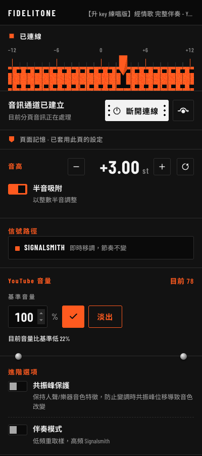
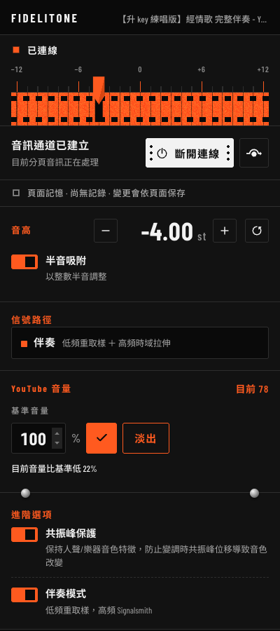

# Fidelitone

Real-time pitch transposition for Chrome tabs. Shift a video or song up or down
in semitones without touching the tempo — for singing along, covers, cover
versions, anything where the track is in the wrong key.



It is MIT licensed, and the audio never leaves your browser. Most of the audio
processing is not mine either — see
[What is actually mine](#what-is-actually-mine), because that distinction is
the interesting part.


## Features

- Pitch shift −12 to +12 semitones, tempo untouched, **~100 ms** measured
  latency (see [Honest limits](#honest-limits))
- **Accompaniment mode** — a 175 Hz crossover so the low band is resampled
  instead of stretched, which is what keeps bass notes solid
- **Per-page memory** — every page URL keeps its own settings, so switching to
  the next video applies them automatically
- **Tab following** — move to another tab and the capture goes with you
- Optional YouTube volume control with a 500 ms ramp against a baseline you keep
- Reports the state honestly, including when the engine fails to start
- Zero services. No account, no analytics, no network calls at all beyond an
  optional web font


## Install

```bash
git clone https://github.com/arWai-CW/fidelitone.git
cd fidelitone
npm install
npm run build
```

Then `chrome://extensions` → enable Developer mode → **Load unpacked** → select
`dist/`.

For development: `npm test`, `npm run typecheck`, `npm run dev`. `npm run
latency` measures the pitch engine in a browser, `npm run preview` serves the
popup against a mocked `chrome.*` API.

`npm run package` validates the build and writes a reproducible zip to
`release/`. Pushing a `v*` tag builds the same zip and attaches it to a GitHub
Release with its SHA-256.


## What is actually mine

Worth being precise, because it is the first thing an audio engineer will ask.

**Borrowed.** The pitch shifting is
[Signalsmith Stretch](https://github.com/Signalsmith-Audio/signalsmith-stretch)
(MIT) — a time-domain stretcher this project calls and schedules. The 175 Hz
crossover and the output limiter are textbook Butterworth and
`DynamicsCompressor` nodes. **The reason it does not fall apart at large
transpositions is Signalsmith's doing, not this project's.**

**The one piece of real signal processing here** is
`src/processors/lowband-resampler.js` — a bounded, phase-locked WSOLA/PSOLA
resampler for the low band. It estimates low-band periods, takes
period-synchronous timeline corrections instead of wrapping into stale
ring-buffer samples, and keeps read latency bounded at rates both below and
above 1.0. It exists because the low band does not go through the STFT phase
vocoder at all: a 60 Hz bass note has too few periods to survive one.



**The rest is plumbing, done carefully** rather than anything exotic — an atomic
handover between tabs, a master output gate that fades around it, per-URL memory
keyed by URL rather than origin, a MAIN-world content script because YouTube's
player API is page-owned JavaScript. Not a highlights list; that is simply what
it takes for the thing to work end to end.

**One finding worth reading.** The accompaniment graph's 90 ms alignment delay is
derived from the engine's 100 ms latency, and the two constants live in different
files with nothing enforcing the relationship. Nobody would have found that if
the latency had not been measured. [ADR-0007](docs/adr/0007-single-pitch-engine.md)


## Honest limits

Chrome imposes these. Fidelitone states them rather than pretending otherwise.

- **Only one tab can be captured at a time.** Switching away releases the
  previous tab, which then plays its own original audio.
- **A tab you never opened the popup on cannot be captured.** Chrome only issues
  the tab-scoped capture permission when you invoke the extension, and revokes
  it on cross-origin navigation or tab close. Auto-follow works only inside a
  session that already has a capture.
- **~100 ms of processing latency.** Workable for singing along, since you
  adjust before you start rather than mid-phrase. It is not a monitoring-grade
  pitch shifter, and the number is measured rather than estimated:
  `npm run latency` fires an impulse into the worklet and timestamps its
  arrival with a tap worklet. The library's own `latency()` agrees to within
  floating-point error, which is how you know the measurement is sound. Latency
  scales with block size — the shipping config measures 100 ms, and halving
  `blockMs` to 20 halves it to 25 ms at some cost in quality and CPU. Add
  `AudioContext.baseLatency` and `outputLatency` for the platform's buffering;
  Chrome does not document tabCapture's input buffering, so a true end-to-end
  figure needs acoustic measurement this repo does not attempt.
- **If the engine fails to start, your audio passes through unprocessed.** The
  signal-path row says `未處理` rather than leaving a slider that appears to
  work. That state was reached deliberately in testing by removing the worklet
  file.


## More

- [`docs/adr/`](docs/adr/) — seven architecture decision records, two of which
  are reversals of features that shipped and were then deleted
- [`docs/runtime-verification.md`](docs/runtime-verification.md) — what was
  actually run on real Chrome, and the numbers
- [`CONTEXT.md`](CONTEXT.md) · [`PRODUCT.md`](PRODUCT.md) · [`DESIGN.md`](DESIGN.md) —
  vocabulary, product constraints, design system


## License

MIT — [LICENSE](LICENSE). The one bundled third-party component, Signalsmith
Stretch, is also MIT. Earlier builds bundled the Rubber Band Library (GPLv2+);
[ADR-0007](docs/adr/0007-single-pitch-engine.md) explains why it was removed,
which is why this project is permissively licensed throughout.

Fidelitone collects nothing and has no server — see [PRIVACY.md](PRIVACY.md).
