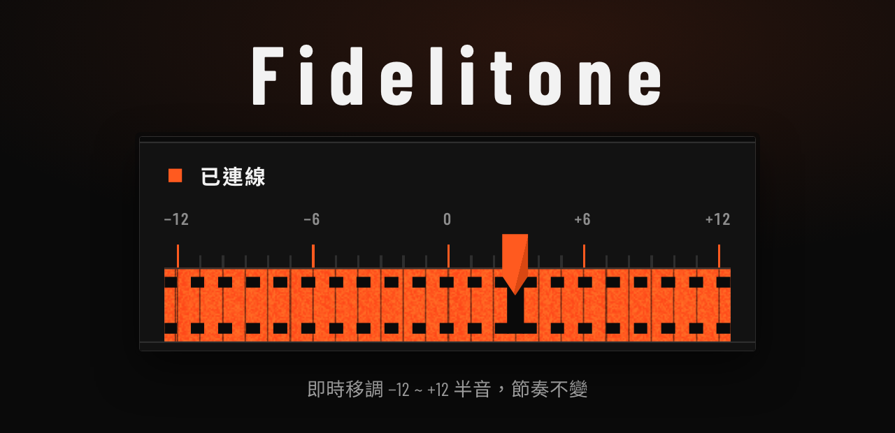
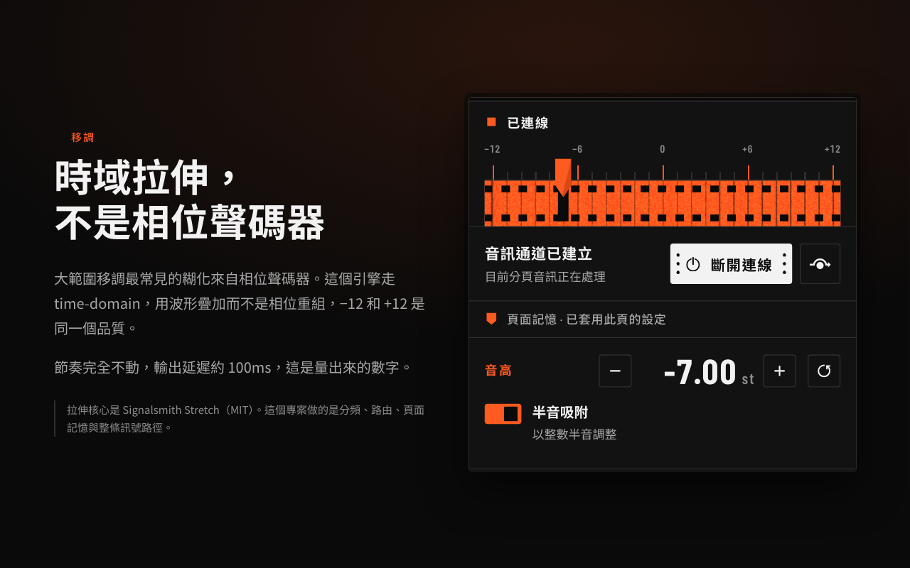
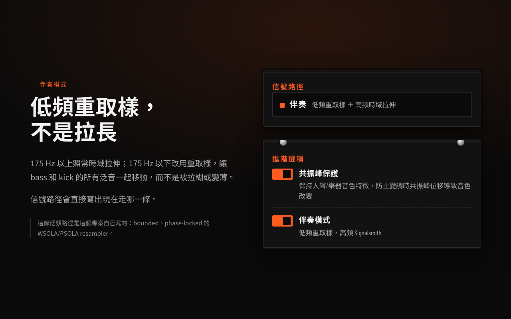
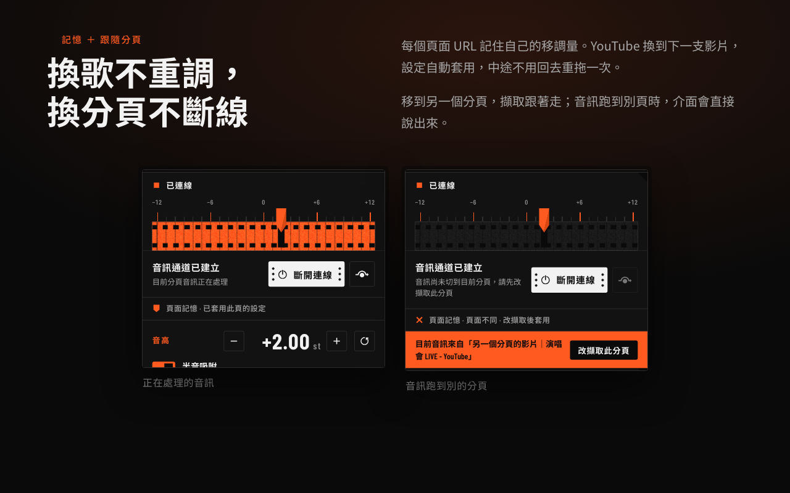

[English](README.md) · [繁體中文](README.zh-TW.md)

# Fidelitone

<a href="docs/images/zh-Hant/readme-hero.zh-Hant.png">
  
</a>

Chrome 分頁的即時移調。把正在播放的影片或音樂升 key 或降 key，節奏完全不變 ——
練唱、cover、KTV 跟唱，曲目 key 不對的時候用。

MIT 授權，音訊全程留在你的瀏覽器。音訊處理的大部分也不是我寫的 ——
見[哪些才是我做的](#哪些才是我做的)，因為那個差別才是重點。

<table>
  <tr>
    <td><b>授權</b></td>
    <td>MIT。唯一內嵌的相依套件 Signalsmith Stretch 也是 MIT。</td>
  </tr>
  <tr>
    <td><b>平台</b></td>
    <td>Chrome MV3 —— 以未封裝項目載入，或從 Release 解壓縮。</td>
  </tr>
  <tr>
    <td><b>延遲</b></td>
    <td><b>約 100ms</b>，由 <code>npm run latency</code> 量測而得，不是估算。</td>
  </tr>
  <tr>
    <td><b>介面</b></td>
    <td>English · 繁體中文 · 日本語，跟著瀏覽器語言走。</td>
  </tr>
  <tr>
    <td><b>音訊</b></td>
    <td>留在裝置上。沒有伺服器、沒有帳號、沒有分析工具。</td>
  </tr>
  <tr>
    <td><b>權限</b></td>
    <td><code>tabCapture</code> · <code>offscreen</code> · <code>storage</code> —— 每項的理由見 <a href="store/README.md">store/README.md</a>。</td>
  </tr>
</table>

## 功能

### 時域移調

<a href="docs/images/zh-Hant/readme-transpose.zh-Hant.png">
  
</a>

−12 到 +12 半音，節奏完全不動，實測延遲約 **100ms**。時域拉伸而不是相位聲碼器，
這就是大範圍移調能保持乾淨的原因。引擎是借來的，誠實的分工見
[哪些才是我做的](#哪些才是我做的)。

### 伴奏模式

<a href="docs/images/zh-Hant/readme-accompaniment.zh-Hant.png">
  
</a>

175 Hz 分頻。以上照常拉伸，以下改用重取樣，讓 bass 音的泛音和 kick 一起移動，
而不是被拉薄。這條低頻路徑是這個專案唯一一段真正的訊號處理。

### 頁面記憶與跟隨分頁

<a href="docs/images/zh-Hant/readme-memory.zh-Hant.png">
  
</a>

每個頁面 URL 記住自己的設定，換到下一支影片就自動套用；移到另一個分頁，擷取
跟著走。音訊跑到別頁時，介面會直接說出來，而不是默默地沒反應。

### 還有

- 選用的 YouTube 音量控制：以 500 毫秒漸變到你保留的基準音量，也能一鍵淡出
- 半音吸附，以及人聲／樂器的共振峰保護
- 誠實回報自己的狀態，包含引擎起不來的時候
- 沒有任何服務。沒有帳號、沒有分析工具、除了一個選用的網路字體以外
  沒有任何對外連線

## 安裝

從 [Releases](../../releases) 抓 zip，或自己用 `npm run package` 產生一份。

1. 下載 `fidelitone-<version>.zip` 並解壓縮。
2. 打開 <kbd>chrome://extensions</kbd>，開右上角的**開發人員模式**。
3. 按**載入未封裝項目**，選擇剛才解壓縮的那個資料夾 —— 裡面有 `manifest.json`
   的那個。

Chrome 載入的是資料夾裡的副本，不是 zip。要更新就把新版本解壓縮覆蓋同一個
資料夾，再按卡片上的重新整理箭頭。

### 從原始碼

```bash
git clone https://github.com/arWai-CW/fidelitone.git
cd fidelitone
npm install
npm run build
```

然後**載入未封裝項目** → `dist/`。

推上 `v*` tag 會用同一套流程打包，並把 zip 附在 GitHub Release 上，附上 SHA-256。

<details>
<summary><b>開發指令</b></summary>

| 指令 | 作用 |
| --- | --- |
| `npm test` | 單元測試與行為凍結測試 |
| `npm run typecheck` | `tsc --noEmit` |
| `npm run build` | 產生 `dist/` |
| `npm run dev` | 同上，改動即重建 |
| `npm run preview` | 用假的 `chrome.*` API 跑 popup，不擷取音訊就能到達任何狀態 |
| `npm run shots` | 重出這一頁的圖，兩種語言 |
| `npm run latency` | 在真的瀏覽器裡量 pitch 引擎 |
| `npm run package` | 驗證 `dist/` 並寫出 release zip |

`npm run preview` 值得記一下：`?s=connected&yt=1&accom=1&pitch=-4` 可以渲染出任何
popup 狀態，`&lang=ja-JP` 則是把它渲染成日文。

</details>

## 哪些才是我做的

值得講清楚，因為這是音訊工程師會先問的問題。

**借來的。** 變調是
[Signalsmith Stretch](https://github.com/Signalsmith-Audio/signalsmith-stretch)
（MIT），一個這個專案呼叫並排程的時域拉伸器。175 Hz 分頻和輸出限幅器是教科書
的 Butterworth 和 `DynamicsCompressor` 節點。**大範圍移調不會壞掉是 Signalsmith
的功勞，不是這個專案的。**

**這裡唯一一段真正的訊號處理**是 `src/processors/lowband-resampler.js` ——
一個 bounded、phase-locked 的低頻 WSOLA/PSOLA resampler。它估低頻週期、做
週期同步的時間軸修正而不是回頭去讀已經舊掉的 ring buffer 樣本，並且在
rate 小於與大於 1.0 兩邊都把讀取延遲壓住。它存在的原因是低頻根本不進
STFT phase vocoder：一個 60 Hz 的 bass 音，週期數不夠撐過一輪。

**剩下的都是認真做的 plumbing**，不是什麼厲害的東西 —— 分頁之間的 atomic
handover、會淡入淡出的 master output gate、以 URL 而不是 origin 為 key 的
記憶、因為 YouTube 的 player API 是頁面自己的 JavaScript 而必須存在的
MAIN-world content script。這不是一份重點清單；端到端能跑起來本來就要這些。

**有一個值得讀的發現。** 伴奏圖的 90ms 對齊延遲是從引擎的 100ms 延遲推導
出來的，而這兩個常數住在不同的檔案裡，沒有任何機制在管它們之間的關係。
如果沒有量延遲，沒有人會發現。 [ADR-0007](docs/adr/0007-single-pitch-engine.md)

## 誠實的限制

這些是 Chrome 規定的。Fidelitone 把它們講出來，而不是假裝沒有。

- **同一時間只能擷取一個分頁。** 切換到別的分頁會釋放前一個，前一個分頁就
  改播它自己的原始音訊。
- **你從來沒開過 popup 的分頁擷取不到。** Chrome 只在你啟動擴充功能時才發出
  該分頁的擷取權限，而且在跨來源導頁或分頁關閉時收回。自動跟隨只在一個已經
  有擷取的 session 裡有效。
- **約 100ms 的處理延遲。** 跟唱時夠用，因為你是在開始唱之前調，不是唱到一半
  才調。這不是監聽級的移調器，而且這個數字是量出來的不是估的：`npm run latency`
  會把一個 impulse 打進 worklet，再用一個 tap worklet 標記它抵達的時間。函式庫
  自己的 `latency()` 跟它吻合到浮點誤差內，這就是這個量測可信的證據。延遲隨
  block 大小改變 —— 出貨設定量到 100ms，把 `blockMs` 減半到 20 就減到 25ms，
  代價是品質和 CPU。`AudioContext.baseLatency` 和 `outputLatency` 要另外加上
  平台的緩衝；Chrome 沒有公開 tabCapture 的輸入緩衝，所以真正的端到端數字需要
  聲學量測，這個 repo 不做。
- **引擎起不來時，音訊會未經處理直接通過。** 信號路徑那一列會寫 `未處理`
  （英文介面是 `Not processed`），而不是留一個看起來能拖、其實沒反應的滑桿。
  這個狀態是在測試時刻意造出來的 —— 把 worklet 檔案刪掉。

## 更多

- [`docs/adr/`](docs/adr/) —— 八份架構決策記錄，其中兩份是把已經上線、然後又
  刪掉的功能翻案
- [`docs/runtime-verification.md`](docs/runtime-verification.md) —— 在真的
  Chrome 上跑了什麼，以及那些數字
- [`docs/i18n-plan.md`](docs/i18n-plan.md) —— 三種介面語言如何不致各自腐化
- [`CONTEXT.md`](CONTEXT.md) · [`PRODUCT.md`](PRODUCT.md) · [`DESIGN.md`](DESIGN.md) ——
  詞彙、產品限制、設計系統

## 授權

MIT —— [LICENSE](LICENSE)。唯一內嵌的第三方元件 Signalsmith Stretch 也是 MIT。
更早的版本有內嵌 Rubber Band Library（GPLv2+）；[ADR-0007](docs/adr/0007-single-pitch-engine.md)
說明為什麼拿掉它，這也是整個專案從頭到尾都是寬鬆授權的原因。

Fidelitone 不收集任何資料，也沒有伺服器 —— 見 [PRIVACY.md](PRIVACY.md)。
